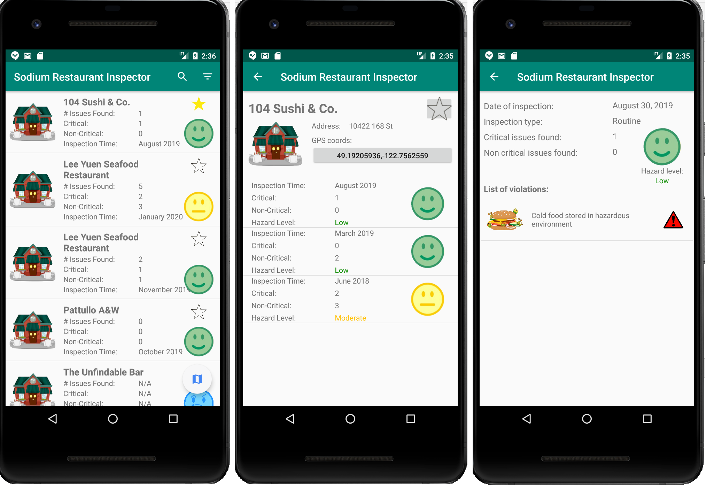

# Surrey Restaurant Inspector

An Android application that displays the health inspection results of the restaurants located in Surrey, BC. The system analyzes the inspection report by calling Surrey’s Open Data API into an ordered list of restaurants.

## Screenshots

    

# Team Sodium

### Members
- William Fung
- Ha Thu Nguyen
- Henry Fang
- Jiwon Jun

### Roles
- Iteration 1:
    - William Fung      (Product Owner)
    - Henry Fang        (Repo Manager)
    - Jiwon Jun         (Scrum Master)
    - Ha Thu Nguyen     (Team Member)
 - Iteration 2:
    - Ha Thu Nguyen     (Product Owner)
    - Henry Fang        (Scrum Master)
    - Jiwon Jun         (Repo Manager)
    - William Fung      (Team Member)
 - Iteration 3:
    - Henry Fang        (Product Owner)
    - William Fung      (Scrum Master)
    - Ha Thu Nguyen     (Repo Manager)
    - Jiwon Jun         (Team Member)